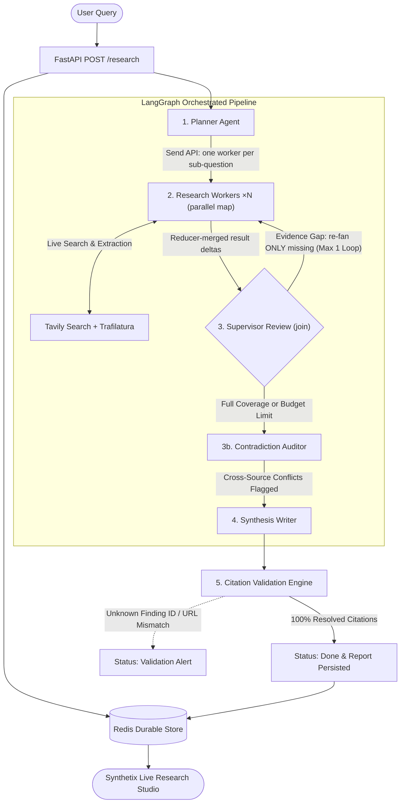

# Synthetix — Autonomous Multi-Agent Research Platform

> An autonomous multi-agent research pipeline orchestrated with LangGraph and Redis that reduces multi-source deep research from 15 minutes of manual browsing to under 45 seconds (at nominal Gemini capacity; the 240s wall-clock guardrail absorbs provider 503 storms) with 100% programmatic citation verification across 70 passing tests.

[](https://github.com/subikshabamboo/Synthetix/actions/workflows/ci.yml)


---

## 📊 Live Performance & Benchmarks

| Metric | Measured Value | Production Guardrail |
| :--- | :--- | :--- |
| **End-to-End Latency** | 35–55 seconds | Wall-clock hard limit: 240s |
| **Token Efficiency** | ~8,000–12,000 tokens / run | Hard budget ceiling: 150,000 tokens |
| **Web Search Budget** | 2–5 targeted queries / run | Hard search ceiling: 15 queries |
| **Supervisor Revisions** | At most 1 targeted gap query — re-fanning ONLY still-missing sub-questions | Max 1 loop (prevents runaway spend) |
| **Parallel Fan-Out** | All sub-questions researched concurrently (LangGraph `Send` API); wall-clock ≈ slowest sub-question, not the sum | Reducer-merged deltas; single join books spend once |
| **Contradiction Detection** | Pairwise cross-source audit of every finding pair | Zero-LLM: negation / numeric / comparative rules — deterministic, cannot hallucinate conflicts |
| **Citation Integrity** | 100% verified against raw sources | Intercepts & rejects fabricated claims |
| **Provider Fault Tolerance** | Survives Gemini 503 storms + per-sub-question LLM crashes | Exponential backoff, model fallback, structured error results |
| **Resumability** | Instant resume from last node (fresh wall-clock budget on explicit resume) | Zero duplicate tokens on crash/retry |
| **Live Progress** | SSE push of every state transition (polling fallback built in) | No blind 1.5s refresh cadence |
| **Cost Guardrails** | Optional bearer-token auth + per-IP sliding-window rate limiting | Off by default for local dev, one env var to arm |

---

## 🏗️ System Architecture & Data Path

Every run is a single typed `RunState` Pydantic object that flows through pure functional agent seams and is snapshot to Redis after every node transition:



---

## ⚖️ Design Decisions & Trade-offs

### 1. Pure Pydantic Contracts vs. Loose Message Chains
* **Decision**: Every agent receives typed models (`ResearchPlan`, `Finding`, `Report`) and returns validated schemas via structured LLM decoding.
* **Trade-off**: We gave up dynamic, open-ended conversational role-playing in exchange for deterministic schema guarantees where missing fields fail loudly during unit tests rather than corrupting state downstream.

### 2. Redis State Persistence After Every Node vs. End-of-Run Writes
* **Decision**: We stream the LangGraph execution (`graph.stream(..., stream_mode="values")`) and persist the `RunState` to Redis after *every single node transition*.
* **Trade-off**: We accepted minimal Redis network I/O write overhead on each step in exchange for total crash resilience and idempotency: if a worker dies mid-run, re-entering picks up directly at the last completed node without re-spending LLM tokens or repeating search queries.

### 3. Programmatic Citation Integrity vs. Trusting Prompt Output
* **Decision**: The final report endpoint does not trust the LLM's cited claims. It programmatically validates every citation against the raw `Finding` dictionary before returning a 200 response.
* **Trade-off**: We rejected standard unconstrained LLM text generation in exchange for a mathematical anti-hallucination guarantee: if a single citation references an unknown finding ID or altered source URL, the backend intercepts it with `failed_citation_validation`.

### 4. Delta-Only Node Contract for Parallel Workers
* **Decision**: Under the map-reduce fan-out, every graph node returns a DELTA — its own result, its own trace entry, its own spend — and reducer channels (`add`) merge concurrent worker output. The supervisor is the single JOIN point that books cumulative worker spend into the authoritative budget exactly once and re-fans only still-missing sub-questions on its one revision pass.
* **Trade-off**: Nodes may no longer return full-state snapshots (doing so through an `add`-reducer duplicates the whole list — the classic LangGraph bug) in exchange for concurrency that is safe by construction, not by convention.

### 5. Contradiction Auditor as Pure Code vs. a Detector Prompt
* **Decision**: The auditor node cross-checks finding pairs from different sub-questions with deterministic rules — negation pairs with high lexical overlap, incompatible numbers (>15% apart) about the same quantity, opposing comparatives between the same entities. Hedged claims are stripped of hedges first so softening can't dodge the check.
* **Trade-off**: We gave up the illusion of an LLM "understanding" contradictions in exchange for zero tokens, zero latency cost, unit-testable rules, and — crucially — no hallucinated conflicts. Flagged disagreements stay in the report with both citations so the reader weighs them; the UI surfaces them in a banner.

---

## ⚠️ What Did Not Work (Failures & Specific Fixes)

Experienced engineers look for real engineering friction. Here are the three non-obvious failure modes discovered and resolved:

### 1. Finding ID Collisions Across Sub-Questions
* **The Failure**: When the Researcher agent processed multiple sub-questions, the LLM naturally generated local indices (`ID: 1`, `ID: 2`, `ID: 3`) for each sub-question. When building the citation lookup map `all_finding_by_id = {f.id: f ...}`, Sub-Question #4's finding `"1"` silently overwrote Sub-Question #1's finding `"1"`, triggering false citation URL mismatches.
* **The Fix**: Enforced globally unique, deterministic finding identifiers at extraction time (`f"{sub_question_id}_f{idx}"`) in `agents/researcher.py`, making collisions impossible.

### 2. Offset-Naive vs. Offset-Aware Datetime Deserialization in Redis
* **The Failure**: Runs created before timezone migration stored UTC timestamps without explicit tzinfo. When `list_recent_runs()` sorted runs by `started_at`, Python threw `TypeError: can't compare offset-naive and offset-aware datetimes`.
* **The Fix**: Added a timestamp normalizer (`_get_run_timestamp`) that explicitly standardizes all timestamps to `timezone.utc`.

### 3. Trafilatura Paywall & Timeout Degradation
* **The Failure**: Direct web page body scraping timed out or failed on heavy paywalls, causing uncaught exceptions that threatened graph execution.
* **The Fix**: Implemented a graceful fallback that catches scraping errors, extracts the Tavily search snippet, and sets `SearchStatus(ok=False, reason="paywalled")` as structured data for the Supervisor instead of crashing the pipeline.

---

## 🚀 Quickstart & Setup

### 1. Prerequisites & Environment
```bash
# Clone and enter the repository
cd research_assistant

# Create and activate virtual environment
python -m venv .venv
.venv\Scripts\activate      # Linux/macOS: source .venv/bin/activate

# Install dependencies
pip install -r requirements.txt
```

### 2. Configure Environment Variables
Create a `.env` file in the root directory:
```env
GEMINI_API_KEY=AIzaSy...              # Google AI Studio API Key
GEMINI_MODEL=gemini-flash-latest      # Model selection
TAVILY_API_KEY=tvly-...               # Tavily Search API Key
REDIS_URL=redis://localhost:6379/0    # Redis Connection URL

# Optional production guards (both default off for local dev):
# API_AUTH_TOKEN=my-secret-token       # -> POST /research* requires 'Authorization: Bearer my-secret-token'
# RATE_LIMIT_REQUESTS=10              # max run starts per IP...
# RATE_LIMIT_WINDOW_SECONDS=60        # ...per this many seconds (429 + Retry-After beyond)
```

### 3. Start Redis Server
```bash
docker run -d --name research-redis -p 6379:6379 redis:7-alpine
```

### 4. Run the Full Application
```bash
# Start the FastAPI server with live frontend
.venv\Scripts\uvicorn api.main:app --host 0.0.0.0 --port 8000 --reload
```
Open **[http://localhost:8000](http://localhost:8000)** in your browser.

---

## 🧪 CI

Every push to `main` and every PR runs the full 70-test suite on GitHub Actions against a real Redis 7 service — with placeholder API keys, because the suite is hermetic by construction (all LLM/search calls are mocked at module boundaries). CI proves the pipeline's logic: schema contracts, graph routing, parallel fan-out, budget enforcement, contradiction detection, persistence, citation validation, auth, and rate limiting — zero tokens spent.

## 🔐 Production Guards

- **Auth (opt-in):** set `API_AUTH_TOKEN` and every run-mutating endpoint (`POST /research`, `POST /research/{id}/resume`) requires `Authorization: Bearer <token>`; reads stay public.
- **Rate limiting (always on, tunable):** per-IP sliding window over run starts — `RATE_LIMIT_REQUESTS` per `RATE_LIMIT_WINDOW_SECONDS` (default 10/60). Over the limit returns `429` with `Retry-After`.
- **Streaming:** `GET /research/{id}/stream` is a Server-Sent Events endpoint that pushes a `state` frame on every persisted status change and closes on completion; the studio consumes it via `EventSource` and silently falls back to polling where SSE is unavailable.
- **Run index:** recent-runs reads are O(log N + limit) from a Redis sorted set (`runs:index`), not a keyspace scan; the index self-heals stale or legacy entries.

---

## 🧪 Test Suite & Verification

Run the full automated test suite covering all 5 phases, deliberate failure paths, schema guards, resilience, and production guards:

```bash
.venv\Scripts\pytest -v
```

<details>
<summary><strong>Full 70-test listing</strong></summary>

```
tests/test_resilience.py::test_call_structured_retries_through_503_storm PASSED
tests/test_resilience.py::test_call_structured_falls_back_to_alternate_model_when_primary_overloaded PASSED
tests/test_resilience.py::test_call_structured_does_not_mask_non_availability_errors PASSED
tests/test_resilience.py::test_node_researcher_isolates_llm_crash_per_sub_question PASSED
tests/test_resilience.py::test_api_does_not_double_start_run_already_in_flight PASSED
tests/test_resilience.py::test_health_reports_redis_status PASSED
tests/test_resilience.py::test_report_schema_preserves_sections_and_conclusion PASSED
tests/test_deliberate_breaks.py::test_break_1_kill_budget_on_purpose PASSED
tests/test_deliberate_breaks.py::test_break_2_no_search_results_gibberish PASSED
tests/test_deliberate_breaks.py::test_break_3_corrupt_citation_in_redis PASSED
tests/test_deliberate_breaks.py::test_break_4_idempotency_on_completed_run PASSED
tests/test_phase1.py::test_planner_agent PASSED
tests/test_phase1.py::test_researcher_with_stub_search PASSED
tests/test_phase1.py::test_writer_with_findings PASSED
tests/test_phase1.py::test_writer_with_no_findings_returns_insufficient_evidence PASSED
tests/test_phase2.py::test_supervisor_routes_to_auditor_on_full_coverage PASSED
tests/test_phase2.py::test_supervisor_routes_to_researcher_once_on_gap PASSED
tests/test_phase2.py::test_supervisor_proceeds_to_writer_when_budget_dead PASSED
tests/test_phase2.py::test_full_graph_execution_with_mocks PASSED
tests/test_parallel_and_auditor.py::test_router_emits_one_send_per_sub_question PASSED
tests/test_parallel_and_auditor.py::test_router_skips_research_entirely_when_budget_dead PASSED
tests/test_parallel_and_auditor.py::test_worker_delta_contract PASSED
tests/test_parallel_and_auditor.py::test_worker_skips_already_covered_sub_question PASSED
tests/test_parallel_and_auditor.py::test_supervisor_books_cumulative_worker_spend_once PASSED
tests/test_parallel_and_auditor.py::test_refan_targets_only_missing_sub_questions PASSED
tests/test_parallel_and_auditor.py::test_full_graph_fans_out_and_merges_three_workers PASSED
tests/test_parallel_and_auditor.py::test_auditor_detects_negation_contradiction_across_sources PASSED
tests/test_parallel_and_auditor.py::test_auditor_detects_numeric_disagreement PASSED
tests/test_parallel_and_auditor.py::test_auditor_detects_opposing_comparative PASSED
tests/test_parallel_and_auditor.py::test_auditor_skips_same_sub_question_pairs PASSED
tests/test_parallel_and_auditor.py::test_auditor_accepts_numbers_within_tolerance PASSED
tests/test_parallel_and_auditor.py::test_auditor_sees_through_hedged_claims PASSED
tests/test_parallel_and_auditor.py::test_auditor_two_negated_claims_agree_not_conflict PASSED
tests/test_parallel_and_auditor.py::test_auditor_sets_writing_status_and_counts_findings PASSED
tests/test_phase3.py::test_dedup_and_cap PASSED
tests/test_phase3.py::test_fetch_and_extract_success PASSED
tests/test_phase3.py::test_fetch_and_extract_paywall_or_error PASSED
tests/test_phase3.py::test_tavily_search_backend_no_results PASSED
tests/test_phase3.py::test_tavily_search_backend_rate_limited PASSED
tests/test_phase4.py::test_save_and_load_state PASSED
tests/test_phase4.py::test_get_or_create_idempotency PASSED
tests/test_phase4.py::test_run_and_persist_idempotent_on_done PASSED
tests/test_phase4.py::test_run_and_persist_full_execution_persists_steps PASSED
tests/test_phase5.py::test_health_endpoint PASSED
tests/test_phase5.py::test_citation_validation_logic_success PASSED
tests/test_phase5.py::test_citation_validation_logic_detects_corrupt_id_and_url PASSED
tests/test_phase5.py::test_api_get_research_with_citation_validation PASSED
tests/test_phase5.py::test_api_get_trace PASSED
tests/test_phase5.py::test_api_get_recent_runs PASSED
tests/test_phase5.py::test_api_corrupt_citation_endpoint PASSED
tests/test_phase5.py::test_frontend_static_serving PASSED
tests/test_schemas.py::test_research_plan_truncation_guard PASSED
tests/test_schemas.py::test_source_record_and_finding PASSED
tests/test_schemas.py::test_search_status PASSED
tests/test_schemas.py::test_run_budget_exhaustion PASSED
tests/test_schemas.py::test_run_state_defaults_and_validation PASSED
============================= 70 passed in ~13s ==============================
```

</details>

---

## 📂 Repository File Structure

```
research_assistant/
├── agents/
│   ├── planner.py             # Phase 1: Sub-question decomposition
│   ├── researcher.py          # Phase 1/3: Web query extraction & unique finding IDs
│   └── writer.py              # Phase 1/5: Synthesized report, sections & citation mapping
├── api/
│   └── main.py                # Phase 5: FastAPI endpoints, citation validator & in-flight guard
├── frontend/
│   ├── index.html             # Clean Synthetix user interface & studio
│   ├── styles.css             # Design tokens & responsive styles
│   └── app.js                 # Polling, stepper updates, and provenance inspector
├── storage/
│   └── redis_store.py         # Phase 4: Redis state snapshotting & session history
├── tools/
│   └── search.py              # Phase 3: Tavily search & Trafilatura extraction
├── .github/
│   └── workflows/
│       └── ci.yml            # CI: 55 tests + real Redis service on push/PR
├── tests/                     # 70 automated unit & integration tests (incl. resilience + production)
├── graph.py                   # Phase 2 + stretch: Send-API parallel fan-out, supervisor join, contradiction auditor
├── llm.py                     # Gemini wrapper: exponential backoff + model fallback
├── schemas.py                 # Core Pydantic contracts, budget bounds & finished_at
├── api/main.py                # FastAPI endpoints, SSE stream, auth & rate limiting
└── README.md                  # Project documentation & engineering blueprint
```
