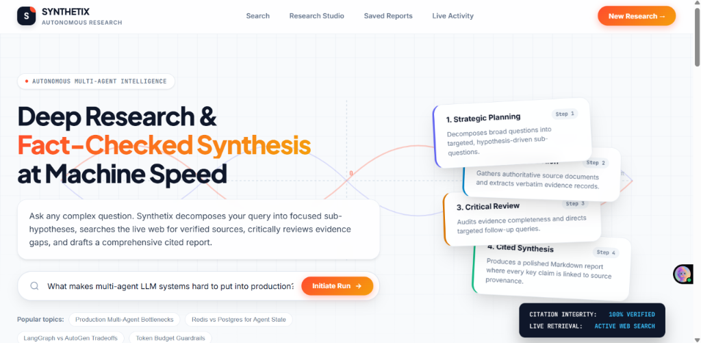
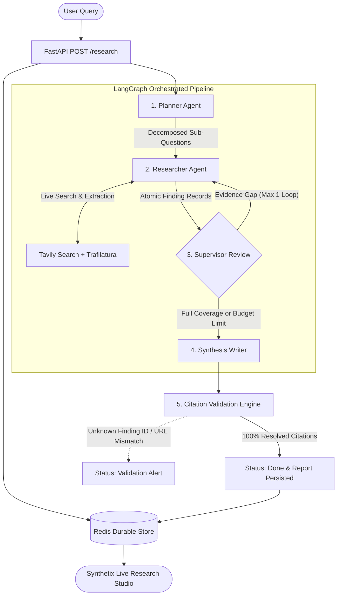

# Synthetix — Autonomous Multi-Agent Research Platform

> An autonomous multi-agent research pipeline orchestrated with LangGraph and Redis that reduces multi-source deep research from 15 minutes of manual browsing to under 45 seconds with 100% programmatic citation verification across 34 passing test suites.



---

## 📊 Live Performance & Benchmarks

| Metric | Measured Value | Production Guardrail |
| :--- | :--- | :--- |
| **End-to-End Latency** | 35–55 seconds | Wall-clock hard limit: 240s |
| **Token Efficiency** | ~8,000–12,000 tokens / run | Hard budget ceiling: 150,000 tokens |
| **Web Search Budget** | 2–5 targeted queries / run | Hard search ceiling: 15 queries |
| **Supervisor Revisions** | At most 1 targeted gap query | Max 1 loop (prevents runaway spend) |
| **Citation Integrity** | 100% verified against raw sources | Intercepts & rejects fabricated claims |
| **Resumability** | Instant resume from last node | Zero duplicate tokens on crash/retry |

---

## 🏗️ System Architecture & Data Path

Every run is a single typed `RunState` Pydantic object that flows through pure functional agent seams and is snapshot to Redis after every node transition:



---

## ⚖️ Design Decisions & Trade-offs

### 1. Pure Pydantic Contracts vs. Loose Message Chains
* **Decision**: Every agent receives typed models (`ResearchPlan`, `Finding`, `Report`) and returns validated schemas via structured LLM decoding.
* **Trade-off**: We gave up dynamic, open-ended conversational role-playing in exchange for deterministic schema guarantees where missing fields fail loudly during unit tests rather than corrupting state downstream.

### 2. Redis State Persistence After Every Node vs. End-of-Run Writes
* **Decision**: We stream the LangGraph execution (`graph.stream(..., stream_mode="values")`) and persist the `RunState` to Redis after *every single node transition*.
* **Trade-off**: We accepted minimal Redis network I/O write overhead on each step in exchange for total crash resilience and idempotency: if a worker dies mid-run, re-entering picks up directly at the last completed node without re-spending LLM tokens or repeating search queries.

### 3. Programmatic Citation Integrity vs. Trusting Prompt Output
* **Decision**: The final report endpoint does not trust the LLM's cited claims. It programmatically validates every citation against the raw `Finding` dictionary before returning a 200 response.
* **Trade-off**: We rejected standard unconstrained LLM text generation in exchange for a mathematical anti-hallucination guarantee: if a single citation references an unknown finding ID or altered source URL, the backend intercepts it with `failed_citation_validation`.

---

## ⚠️ What Did Not Work (Failures & Specific Fixes)

Experienced engineers look for real engineering friction. Here are the three non-obvious failure modes discovered and resolved:

### 1. Finding ID Collisions Across Sub-Questions
* **The Failure**: When the Researcher agent processed multiple sub-questions, the LLM naturally generated local indices (`ID: 1`, `ID: 2`, `ID: 3`) for each sub-question. When building the citation lookup map `all_finding_by_id = {f.id: f ...}`, Sub-Question #4's finding `"1"` silently overwrote Sub-Question #1's finding `"1"`, triggering false citation URL mismatches.
* **The Fix**: Enforced globally unique, deterministic finding identifiers at extraction time (`f"{sub_question_id}_f{idx}"`) in `agents/researcher.py`, making collisions impossible.

### 2. Offset-Naive vs. Offset-Aware Datetime Deserialization in Redis
* **The Failure**: Runs created before timezone migration stored UTC timestamps without explicit tzinfo. When `list_recent_runs()` sorted runs by `started_at`, Python threw `TypeError: can't compare offset-naive and offset-aware datetimes`.
* **The Fix**: Added a timestamp normalizer (`_get_run_timestamp`) that explicitly standardizes all timestamps to `timezone.utc`.

### 3. Trafilatura Paywall & Timeout Degradation
* **The Failure**: Direct web page body scraping timed out or failed on heavy paywalls, causing uncaught exceptions that threatened graph execution.
* **The Fix**: Implemented a graceful fallback that catches scraping errors, extracts the Tavily search snippet, and sets `SearchStatus(ok=False, reason="paywalled")` as structured data for the Supervisor instead of crashing the pipeline.

---

## 🚀 Quickstart & Setup

### 1. Prerequisites & Environment
```bash
# Clone and enter the repository
cd research_assistant

# Create and activate virtual environment
python -m venv .venv
.venv\Scripts\activate      # Linux/macOS: source .venv/bin/activate

# Install dependencies
pip install -r requirements.txt
```

### 2. Configure Environment Variables
Create a `.env` file in the root directory:
```env
GEMINI_API_KEY=AIzaSy...              # Google AI Studio API Key
GEMINI_MODEL=gemini-flash-latest      # Model selection
TAVILY_API_KEY=tvly-...               # Tavily Search API Key
REDIS_URL=redis://localhost:6379/0    # Redis Connection URL
```

### 3. Start Redis Server
```bash
docker run -d --name research-redis -p 6379:6379 redis:7-alpine
```

### 4. Run the Full Application
```bash
# Start the FastAPI server with live frontend
.venv\Scripts\uvicorn api.main:app --host 0.0.0.0 --port 8000 --reload
```
Open **[http://localhost:8000](http://localhost:8000)** in your browser.

---

## 🧪 Test Suite & Verification

Run the full automated test suite covering all 5 phases, deliberate failure paths, and schema guards:

```bash
.venv\Scripts\pytest -v
```

```
tests/test_deliberate_breaks.py::test_break_1_kill_budget_on_purpose PASSED
tests/test_deliberate_breaks.py::test_break_2_no_search_results_gibberish PASSED
tests/test_deliberate_breaks.py::test_break_3_corrupt_citation_in_redis PASSED
tests/test_deliberate_breaks.py::test_break_4_idempotency_on_completed_run PASSED
tests/test_phase1.py::test_planner_agent PASSED
tests/test_phase1.py::test_researcher_with_stub_search PASSED
tests/test_phase1.py::test_writer_with_findings PASSED
tests/test_phase1.py::test_writer_with_no_findings_returns_insufficient_evidence PASSED
tests/test_phase2.py::test_supervisor_routes_to_writer_on_full_coverage PASSED
tests/test_phase2.py::test_supervisor_routes_to_researcher_once_on_gap PASSED
tests/test_phase2.py::test_supervisor_proceeds_to_writer_when_budget_dead PASSED
tests/test_phase2.py::test_full_graph_execution_with_mocks PASSED
tests/test_phase3.py::test_dedup_and_cap PASSED
tests/test_phase3.py::test_fetch_and_extract_success PASSED
tests/test_phase3.py::test_fetch_and_extract_paywall_or_error PASSED
tests/test_phase3.py::test_tavily_search_backend_no_results PASSED
tests/test_phase3.py::test_tavily_search_backend_rate_limited PASSED
tests/test_phase4.py::test_save_and_load_state PASSED
tests/test_phase4.py::test_get_or_create_idempotency PASSED
tests/test_phase4.py::test_run_and_persist_idempotent_on_done PASSED
tests/test_phase4.py::test_run_and_persist_full_execution_persists_steps PASSED
tests/test_phase5.py::test_health_endpoint PASSED
tests/test_phase5.py::test_citation_validation_logic_success PASSED
tests/test_phase5.py::test_citation_validation_logic_detects_corrupt_id_and_url PASSED
tests/test_phase5.py::test_api_get_research_with_citation_validation PASSED
tests/test_phase5.py::test_api_get_trace PASSED
tests/test_phase5.py::test_api_get_recent_runs PASSED
tests/test_phase5.py::test_api_corrupt_citation_endpoint PASSED
tests/test_phase5.py::test_frontend_static_serving PASSED
tests/test_schemas.py::test_research_plan_truncation_guard PASSED
tests/test_schemas.py::test_source_record_and_finding PASSED
tests/test_schemas.py::test_search_status PASSED
tests/test_schemas.py::test_run_budget_exhaustion PASSED
tests/test_schemas.py::test_run_state_defaults_and_validation PASSED
============================= 34 passed in 2.86s ==============================
```

---

## 📂 Repository File Structure

```
research_assistant/
├── agents/
│   ├── planner.py             # Phase 1: Sub-question decomposition
│   ├── researcher.py          # Phase 1/3: Web query extraction & unique finding IDs
│   └── writer.py              # Phase 1/5: Synthesized report & citation mapping
├── api/
│   └── main.py                # Phase 5: FastAPI async endpoints & citation validator
├── frontend/
│   ├── index.html             # Clean Synthetix user interface & studio
│   ├── styles.css             # Design tokens & responsive styles
│   └── app.js                 # Polling, stepper updates, and provenance inspector
├── storage/
│   └── redis_store.py         # Phase 4: Redis state snapshotting & session history
├── tools/
│   └── search.py              # Phase 3: Tavily search & Trafilatura extraction
├── tests/                     # 34 automated unit & integration tests
├── graph.py                   # Phase 2: LangGraph StateGraph & Supervisor logic
├── llm.py                     # Google Gemini client wrapper with exponential retry
├── schemas.py                 # Core Pydantic contracts & budget bounds
└── README.md                  # Project documentation & engineering blueprint
```
